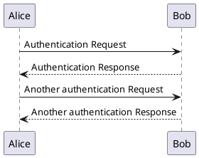

## Frontmatter

A page can have an optional frontmatter. Such a page can look like this:

```md
---
title: Main Page
aliases:
  - Main
categories:
  - General
---

Page content here.
```

## Basic inline formatting

<table>
  <thead>
    <tr>
      <th>Description</th>
      <th>Syntax</th>
      <th>Output</th>
    </tr>
  </thead>
  <tbody>
    <tr>
      <td>Italic text</td>
      <td><code>*italic*</code></td>
      <td><em>italic</em></td>
    </tr>
    <tr>
      <td>Bold text</td>
      <td><code>**bold**</code></td>
      <td><strong>bold</strong></td>
    </tr>
    <tr>
      <td>Bold italic text</td>
      <td><code>***bold & italic***</code></td>
      <td><strong><em>bold & italic</em></strong></td>
    </tr>
    <tr>
      <td>Strike-throughtext</td>
      <td><code>~~strike-through~~</code></td>
      <td><s>strike-through</s></td>
    </tr>
    <tr>
      <td>Inline code</td>
      <td><code>`Code`</code></td>
      <td><code>Code</code></td>
    </tr>
  </tbody>
</table>

## Links

<table>
  <thead>
    <tr>
      <th>Description</th>
      <th>Syntax</th>
      <th>Output</th>
    </tr>
  </thead>
  <tbody>
    <tr>
      <td>Internal link</td>
      <td><code>[Main Page](Main_Page.md)</code></td>
      <td><a href="#">Main Page</a></td>
    </tr>
  </tbody>
</table>

## Images

<table>
  <thead>
    <tr>
      <th>Description</th>
      <th>Syntax</th>
      <th>Output</th>
    </tr>
  </thead>
  <tbody>
    <tr>
      <td>Inline image</td>
      <td><pre></pre></td>
      <td></td>
    </tr>
  </tbody>
</table>

## Section headings

<table>
  <thead>
    <tr>
      <th>Description</th>
      <th>Syntax</th>
      <th>Output</th>
    </tr>
  </thead>
  <tbody>
    <tr>
      <td>Level 2</td>
      <td><code>## Level 2</code></td>
      <td><h2>Level 2</h2></td>
    </tr>
    <tr>
      <td>Level 3</td>
      <td><code>### Level 3</code></td>
      <td><h3>Level 3</h3></td>
    </tr>
    <tr>
      <td>Level 4</td>
      <td><code>#### Level 4</code></td>
      <td><h4>Level 4</h4></td>
    </tr>
    <tr>
      <td>Level 5</td>
      <td><code>##### Level 5</code></td>
      <td><h5>Level 5</h5></td>
    </tr>
    <tr>
      <td>Level 6</td>
      <td><code>###### Level 6</code></td>
      <td><h6>Level 6</h6></td>
    </tr>
  </tbody>
</table>

## Formatted text

<table>
  <thead>
    <tr>
      <th>Description</th>
      <th>Syntax</th>
      <th>Output</th>
    </tr>
  </thead>
  <tbody>
    <tr>
      <td>Preformatted text</td>
      <td><pre>    Start each line<br>    with four spaces</pre></td>
      <td><pre>Start each line<br>with four spaces</pre></td>
    </tr>
    <tr>
      <td>Syntax highlighting</td>
      <td><pre>```js<br>console.log('Syntax highlighting!');<br>```</td>
      <td>

```js
console.log('Syntax highlighting!');
```

</td>
    </tr>
  </tbody>
</table>

## Lists

<table>
  <thead>
    <tr>
      <th>Description</th>
      <th>Syntax</th>
      <th>Output</th>
    </tr>
  </thead>
  <tbody>
    <tr>
      <td>Bullet list</td>
      <td><pre>* Item 1<br>* Item 2<br>  * Item 2a<br>* Item 3</td>
      <td><ul><li>Item 1<li>Item 2<ul><li>Item 2a</ul><li>Item 3</ul></td>
    </tr>
    <tr>
      <td>Numbered list</td>
      <td><pre>1. Item 1<br>1. Item 2<br>   1. Item 2a<br>1. Item 3</td>
      <td><ol><li>Item 1<li>Item 2<ol><li>Item 2a</ol><li>Item 3</ol></td>
    </tr>
    <tr>
      <td>Definition list</td>
      <td><pre>Item 1<br>~ Definition 1<br><br>Item 2<br>~ Definition 2a<br>~ Definition 2b<br><br>Item 3<br>: Definition 3</pre></td>
      <td><dl><dt>Item 1</dt><dd>Definition 1</dd><dt>Item 2</dt><dd>Definition 2a</dd><dd>Definition 2b</dd><dt>Item 3</dt><dd>Definition 3</dl></td>
    </tr>
  </tbody>
</table>

## Tables

<table>
  <thead>
    <tr>
      <th>Description</th>
      <th>Syntax</th>
      <th>Output</th>
    </tr>
  </thead>
  <tbody>
    <tr>
      <td>Simple table</td>
      <td><pre>| Language | Aliases |<br>| -------- | ------- |<br>| ARM assembly | armasm, arm |</pre></td>
      <td>
        <table>
          <thead><tr><th>Language</th><th>Aliases</th><tr></thead>
          <tbody><tr><td>ASM assembly</td><td>armasm, arm</td></td></tbody>
        </table>
      </td>
    </tr>
  </tbody>
</table>

## Fenced code blocks

A fenced code block follows the syntax:

~~~md
```js
console.log('Hello World!');
```
~~~

A language name should follow the initial three backticks.
Additional white space spearated attributes may be defined after a white space
and *may* be enclosed by `{` curly braces `}`.
The actual code starts on the next line.

Some possible attributes are:

| Attribute (example) | Description |
| ------------------- | ----------- |
| `.html`             | Set language by filename extension |
| `.foo .bar`         | Add CSS classes `foo` and `bar` to the `<pre>` element |
| `#example`          | Add HTML ID `example` to the `<pre>` element |
| `style="..."`       | Add custom CSS style to the `<pre>` element |
| `lineos=true`       | Enable line numbering
| `numbered`          | Enable line numbering
| `linenostart=42`    | Start numbering with given number
| `startline=42`      | Start numbering with given number
| `hl_lines="43-44 50"` | Highlight given lines
| `marked="43-44 50"` | Highlight given lines
| `title="Example Code"` | Set title (or filename) for code block
| `dark`              | Force dark mode
| `removed=2,8`       | Mark given lines as removed
| `added=3,6,7-10`    | Mark given lines as added

```js
console.log('Simple JavaScript example');
```

```js #example-code-id .example-code-class
console.log('#example-code-id .example-code-class');
```

```js numbered
console.log('line 1');
console.log('line 2');
```

```js marked="3,4 6-8"
console.log('line 1');
console.log('line 2');
console.log('line 3 (marked)');
console.log('line 4 (marked)');
console.log('line 5');
console.log('line 6 (marked)');
console.log('line 7 (marked)');
console.log('line 8 (marked)');
console.log('line 9');
console.log('line 10');
```

```js removed=1 added=2
console.log('removed line');
console.log('added line');
```

```js title="Example Title"
console.log('code block with title');
```




```lilypond
{
  \clef treble
  c'4 e' g' c''
  c'4 g b c'
  \clef bass
  c,4 e, g, c
  c,4 g,, b,, c,
}
```

```lilypond
\fixed c'' {
  \tempo 4 = 125
  \key cis \minor
  cis8 dis e gis, dis fis, e, dis, cis,
  gis, cis e dis e fis gis, b, e dis cis
  gis, cis f cis fis cis gis cis a cis
  dis b, gis, b, dis b, e b, fis b, gis b,
  cis a, gis, a, cis e b, gis, fis, gis, b, e
  fis, gis, a, e, dis, e, fis,
  dis, b,, a,, gis,, e, a,, e, gis,,
}
```

```filetree
+ *(Project Folder)*/
  + Assets/
    + 3rd-Party/
      + TextMesh Pro/
    + Animations/
    + Audio/
    + Fonts/
    + Gizmos/
    + Materials/
    + Models/
    + Prefabs/
    + Scenes/
      + Levels/
    + **Scripts**/
      + Components/
        + Script.cs
      + Editor/
    + ScriptTemplates/
    + Shaders/
    + Sprites/
    + Textures/
    + Tiles/
    + TilePalettes/
  + Build/
  + Library/
  + Logs/
  + Packages/
  + ProjectSettings/
  + Plug-ins/
```

### Rendering

Certain languages, such as `chartjs`, `lilypond`, `mermaid` or `plantuml` may be
rendered to their actual representation (such as generated images or music).
